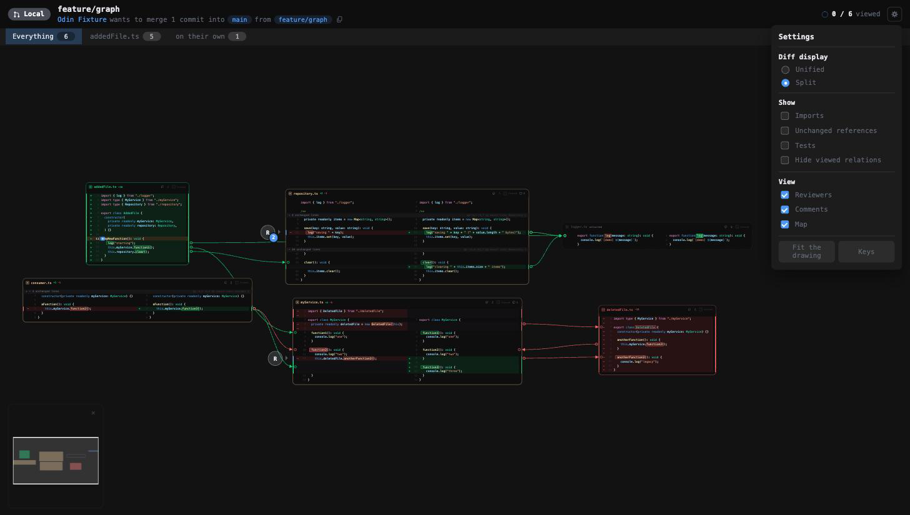
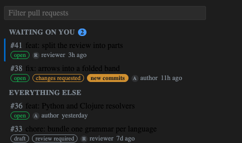
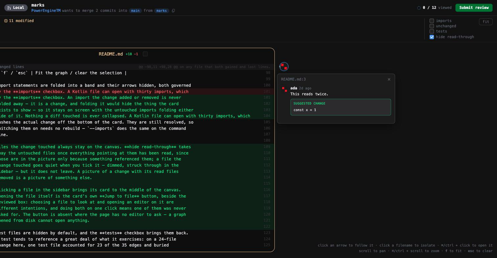
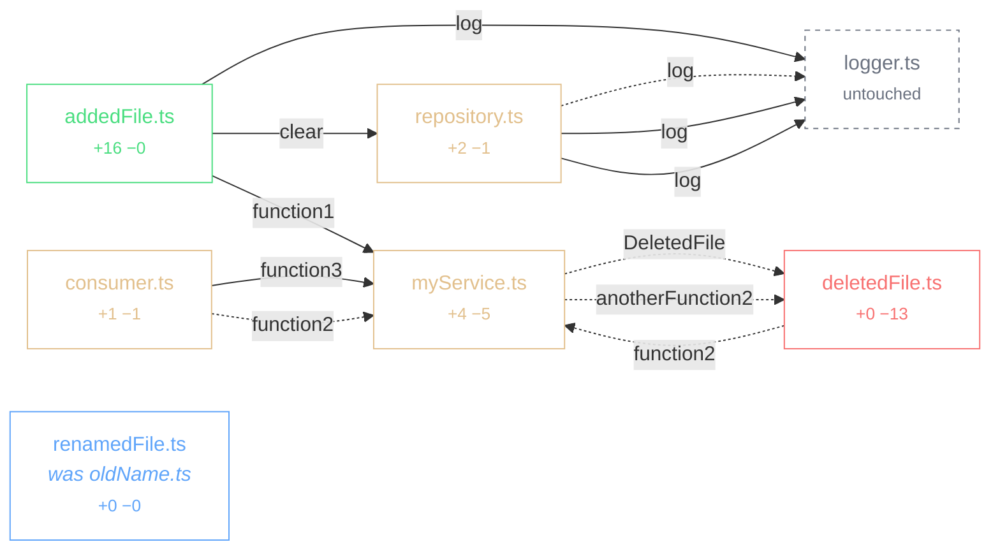

# 🐦‍⬛ Odin PR Review 🐦‍⬛


*“He saw over all worlds and every man's activity and understood everything he
saw.”*

— Snorri Sturluson, *Prose Edda*, Chapter 38

---

**An Integrated Review Environment (IRE) — one of the first.** Writing code has had an
IDE for forty years; reading it has had a web page. Odin is a claim that the
second half deserves the same treatment: one place that holds the change, the
conversation about it, and the state of your reading, behind one set of
gestures. If an IDE is where code is written, an IRE is where it is read.

A pull request is a graph, not a list. Odin turns the diff between a branch and
its base into a change graph: every file is a vertex, every call-site reference
in the change is a directed edge, and the colour of an edge tells you whether
the change added that relationship or took it away.


Every picture in this README is generated from the same fixture by
`scripts/generate-examples.sh`, and the sources are committed under
[`docs/examples`](docs/examples).

## What an Integrated Review Environment means here

An IDE earned its name by putting the editor, the compiler, the debugger and the
navigator behind one set of gestures. Review has none of that: the diff is in a
browser tab, the code is in an editor, what you have already read is in your
head, and following a call means searching for its name somewhere else.

Odin puts those in one place.

- **The change is a picture, not a list.** Files sit where their relationships
  put them, and a reference is an arrow you can follow.
- **Navigation is the primitive.** Click an arrow to travel; press the dot at
  either end to jump there and back. Arrow keys walk the chain a file at a time.
- **Reading is state.** What you have marked off, where the camera was in each
  part of the change, which commit you last read — all of it is remembered, and
  a branch that moved since you read it says so.
- **The conversation lives beside the code.** Threads, reactions, replies and a
  pending review, in the same window as the graph, going to the forge as one
  review rather than a notification per remark.
- **It runs where you work.** The same page is a self-contained HTML file from
  the command line and a webview inside VS Code.

## Install

macOS and Linux, from a clone:

```sh
./scripts/install.sh
```

It checks what is on the machine, installs the dependencies, builds every
package, packages the extension and installs it into VS Code — then links the
command line tool into `~/.local/bin` if that is somewhere it can write.

Two things it will not do for you. `gh` is what Odin asks for pull request
titles, comments, checks and the list of what is open, so install it and run
`gh auth login` if the script says it is missing — everything else works
without it, against whatever branch is checked out. And if you have no `code`
on the PATH the extension is built but not installed; the script says where the
package is, and VS Code adds the command itself from **Shell Command: Install
'code' command in PATH**. It looks inside the usual application bundles first,
so on macOS this rarely comes up.

Then open a repository in VS Code and run **Odin: Review** from the palette, or
press the Odin mark in the activity bar to pick a pull request.

## Quick start

```sh
yarn install
yarn build
ln -sf "$PWD/packages/cli/dist/main.js" ~/.local/bin/odin   # or call it by path

# Render the change under review and print the url to open
odin view

# Human-readable overview
odin graph --summary

# The graph itself
odin graph --resolve -o graph.json
```

`view` is the one command worth remembering. It renders what the editor shows —
references resolved, the pull request's own comments marked against their lines
— writes it beside the repository and prints a `file://` url. The file name
comes from the repository and the branch pair, so reopening the same review
reopens the same address; `--serve [port]` hands back an `http://127.0.0.1` one
instead, for the callers a file url cannot reach.

The page it writes cannot post anything back — there is nothing behind a file to
post through. Writing is the command line's own job:

```sh
odin comments                                  # what has already been said
odin review --event comment --body "notes" \
  --comment "src/Dao.kt:180-185:this reads twice" --dry-run
odin approve
```

Everything that touches the forge goes through `gh`, so it acts as whoever is
authenticated and this program stores no credentials of its own. `--dry-run`
prints the exact payload and sends nothing, which is where a malformed comment
gets caught — the forge rejects a whole review for one bad range, taking every
other remark in it down as well.

Try it against the built-in fixture, which reproduces the design sketch:

```sh
fixtures/make-demo-repo-ts.sh /tmp/odin-demo
node packages/cli/dist/main.js graph -C /tmp/odin-demo -b main -H feature/graph \
  --resolve --format html -o /tmp/odin-demo.html
```

## Renderers

One layout engine feeds every output, so they are the same picture in different
materials rather than four independent drawings.

### Interactive — `--format html`

A single self-contained file. No server, no network, no build step: open it from
disk, or hand the same markup to an editor webview.

Hovering an arrow isolates it and names the reference it resolved to. Clicking
an arrow travels to its destination and flashes the card, which is the gesture
the whole tool is built around — you follow a change the way you would follow it
in an editor, but without losing your place.


Everything the page can be told to do is behind one button. The gear holds the
diff display (split or unified), what to show (imports, unchanged references,
tests, whether to hide files whose relations have all been read), which corners
of the screen to keep (reviewers, comments, the map), a key-binding panel, and
the note about any language it could not colour.



A change that comes apart into pieces is shown as pieces: the tabs along the top
are the parts of the graph that do not reach each other, each with its own file
count, its own progress and its own camera. Coming back to a part puts you where
you left it.

Cards show the change, not the file. A run of untouched code that no arrow
reaches collapses into a single band carrying the hunk header, so a card stays
the size of its change rather than the size of its file. Line numbers run in two
columns — base on the left beside the +/− marker, head on the right — because a
single shared column interleaves the two numbering schemes and reads as nonsense
on any file that both gained and lost lines. A line that exists on one side only
leaves the other column empty, the way the forge leaves it: a stand-in number
there is either the same value repeated down a whole insertion, or a number the
line does not have. A wholly added or deleted file is the exception — it has one
numbering, and both columns carry it, because an empty column down a whole card
reads as a column that failed to draw.

| Gesture | Effect |
| --- | --- |
| Hover an arrow | Isolate it, show the resolved reference and its confidence |
| Click an arrow | Travel to the definition it points at |
| Click the dot at an arrow's start | Put its destination in the middle of the screen |
| Click a boxed name at either end | Travel to the other end |
| Click the dot inside the card an arrow lands in | Go back to where that arrow came from |
| Click a filename | Isolate that file and everything it touches |
| Scroll / ⌘-scroll | Pan / zoom around the cursor |
| Click a gap | Open the untouched code it stands for |
| Click *show N more lines* | Reveal the rest of a truncated card |
| `h` / `esc` | Fit the graph / clear the selection |
| `←` `→` `↑` `↓` | Walk to the next file in the chain |
| `enter` / `c` / `F` | Mark it read / comment on it / open it in the editor |

Import statements are folded into a band and their arrows hidden, both governed
by the **imports** checkbox. An import the change added or removed is never
folded away — it is a change, and folding it would hide the thing the card
exists to show — so it stays on screen with the untouched imports folding either
side of it. Nothing a diff touched is ever collapsed. A Kotlin file can open with thirty imports, which
pushes the actual change off the bottom of the card. They are still resolved, so
switching them on needs no rebuild — `--imports` does the same on the command
line.

Files the change touched always stay on the canvas. **hide viewed relations** takes
away the untouched files once everything pointing at them has been read, since
those are in the picture only because something referenced them; a file the
change touched goes quiet when you tick it — dimmed, struck through in the
sidebar — but it does not leave. A picture of a change with its read files
removed is a picture of something else.

Clicking a file in the sidebar brings its card to the middle of the canvas.
Opening the file itself is the card's own **Jump to file** button, beside the
reviewed box: choosing a file to look at and opening an editor on it are
different intentions, and doing both on one click means one of them was never
asked for. The button is absent where the page has no editor to ask — a graph
opened from disk cannot open anything.

Test files are hidden by default, and the **tests** checkbox brings them back.
A test tends to reference a great deal of what it exercises: on a 24-file
change here, one test file accounted for 23 of the 35 edges and buried
everything else. They are hidden rather than dropped, because sometimes the
tests *are* the change. `--tests` does the same on the command line.

A line an arrow points at is always shown. It survives the untouched-code
collapse, it survives the import fold, and the source around it is fetched when
the diff itself does not reach that far — material that overlaps the hunk above
it is trimmed to the part that is new rather than dropped whole, which used to
take the pointed-at line with it. On a 164-edge Kotlin branch every target now
lands on its own line.

A card shows every line the change touched, however many there are, and every
line something points at. The 42-row cap holds back only what is neither: a tail
of untouched context hanging off the end, behind a bar that reveals it. A card
is a picture of a change, and holding part of that change behind a bar the
reader has to notice is how a review misses something.

An import names a file rather than a position in it, so those arrows meet the
card at its title instead of landing on whatever line one happens to hold.

Both ends of an arrow carry a box around the name, in the change's own colour:
the call at the near end, the definition it resolved to at the far one. The
arrow reaches a line; the box says which word on it, which is the difference
between "somewhere in here" and the answer. Pressing either box travels to the
other end, and a dot where the arrow leaves does the same for the destination.
Following a reference across a large change otherwise means finding the other
end by eye and then finding your way home the same way.

Source: [`docs/examples/graph.html`](docs/examples/graph.html).

### VS Code extension

Install the packaged build and review without leaving the editor:

```sh
code --install-extension dist/odin-pr-review-0.1.0.vsix
```



Before a graph exists, the sidebar lists the repository's open pull requests —
number, title, draft or open, review state, the author's face and how long ago
it last moved — with a filter box above them. What the forge is waiting on
**you** for comes first, under its own heading. Ordering is by activity rather
than by creation, falling back to creation within the same hour so a burst of
comments cannot reshuffle the list under you.

A pull request you have opened before and that has been pushed to since carries
a **new commits** chip: the forge goes on showing the verdict you left on a
commit that is no longer the head, and this is the only thing in the row that
says so.

Clicking a row checks out its branch and builds the graph; the branch you are on
is marked down its left edge. Checking out refuses outright while the working
tree is dirty, since carrying uncommitted changes onto another branch is not a
decision to make on someone's behalf — and while the graph is being built, the
panel shows the mark, breathing, with the build's own progress under it.



A thread can be answered in place, reacted to with the forge's eight emoji, and
each remark carries its own menu: copy its link or its markdown, quote it into a
reply, and — on your own remarks only, since the forge would refuse anyone
else's — edit or delete it. Deleting asks first, because the forge has no undo
for it either. Everything is read back from the forge afterwards rather than
guessed at locally, so what you see is what is actually there, including
whatever someone else wrote while you were reading.

Comments already on the pull request appear beside the file rather than inside
it: the author's picture in the margin, at the height of the line it is about,
pointing back at it. A remark belongs to a line but is not part of the code, and
threading it through the diff pushes the code around to make room for something
the reader may not want to read yet. Clicking opens the thread under the mark,
with a count on the mark where a thread has more than one remark. Pictures are
inlined into the document, so a page that fetches nothing still shows them, and
an author whose picture could not be fetched gets their initials.

Comments already on the pull request are marked against the lines they belong
to. Clicking a line writes a new one, optionally as a suggestion; they collect
into a pending review rather than being posted one at a time, and go out
together as **Approve**, **Comment** or **Request changes** — behind a
confirmation that names the verdict, since a review is visible to everyone and
cannot be taken back from here.


The composer is pinned under the last line it is about, at that file's own left
edge, the way an inline comment box sits in a diff — a remark belongs to a
passage, and a box that floats where the cursor happened to be makes the reader
hold the connection in their head. It carries the forge's own furniture: Write
and Preview, the markdown buttons, and a primary that says *Start a review*
until there is one and *Add review comment* after. The same box writes a reply
and a review summary — a line comment, an answer and a verdict are one act with
three destinations, and giving two of them a bare textarea taught two habits for
one job. Preview renders headings, lists, task
lists, quotes, tables, rules, strikethrough and fenced code, and escapes
everything first — the text comes from a person and this page draws it, so
nothing typed can become markup by accident. A fenced block is coloured by the
same grammars and theme the cards use, so a Kotlin snippet in a remark looks
like the Kotlin in the file above it; the grammars live with the extension, so a
page opened from disk keeps the plain text instead.

The last button has no equivalent on the forge because it is ours: it opens a
suggestion block already filled with the lines being commented on. A suggestion
has to be the complete replacement for the lines it covers, and retyping them
from memory is how the wrong indentation gets in.

Only lines the forge can see accept a comment. A card also carries source Odin
fetched so that an arrow had somewhere to land, and the forge would refuse a
remark on one of those — after it had been written, which is the worst moment to
find out.

Most remarks are about a passage rather than a line, so a comment can cover
one: drag down the card, or click a line and shift-click another, and the
composer says which lines it is about in the forge's own notation — `R164–R166`
for the head side, `L` for the base. The pick is drawn the way a diff viewer
draws one — the lines washed, an edge down where the code starts, and a handle
at each end — and it survives cancelling the composer, since changing the
wording is not changing your mind about the lines. Escape or a click away
drops it. A comment already made is drawn as a single bracket down the margin
instead of a mark per line, and a suggestion written against a span replaces
the whole block. A suggestion previews as the change it is — the lines it
replaces above the lines it puts there, numbered where they sit in the file and
coloured by the file's own grammar — because a block of green with no idea what
it is replacing is half the story.

Closing a box keeps what is in it. A reviewer who shuts a composer to look at
the code again, or a thread to check another file, has not changed their mind
about the sentence they were half way through; the text comes back when the same
lines, the same thread or the same review is opened again, and only sending it
clears it. Comments already on the pull request keep their
own spans, including the ones the branch has since moved out from under.

Above the graph is the header the pull request has on the forge: its state, its
title and number, who is merging what into where, how much of it you have read,
and the button that sends the review. A reviewer arriving here has just come
from that page or is about to go back to it, and answering "what am I looking
at" in a second shape would mean learning a second shape for nothing. It renders
without a pull request too — a branch compared against another branch still has
an author, a commit count and two ref names. The forge half is asked of the `gh`
command line, so it inherits whatever authentication you already have, and its
absence changes nothing else. `--pr` does the same on the command line.

A filter box sits under the progress bar, and what matched is marked in the
editor's own highlight colour — every occurrence, not just the first, since a
path can carry the same word twice. A file matches on its path, a
reference on the symbol it resolves to and the file and line it lands in — so
searching a function name finds both the files that call it and the calls
themselves, with the matching file's references opened rather than left behind a
twisty. Folders follow their contents; an empty one is not a result.

Odin gets its own activity bar entry. The sidebar lists every changed file with
its status, and expands to show the references leaving it — the graph as a list,
for when a change is too large to take in visually or you just want to scan.
Clicking a file opens its diff; clicking a reference follows it.

Then run **Odin: Review Pull Request as a Graph** from the command palette, or
trigger it from anywhere with a link:

```sh
code --open-url "vscode://odin.odin-pr-review/review?base=main"
```

The extension requires a trusted workspace. It runs git and type-checks your
files to resolve references, which is exactly what workspace trust exists to
gate, so it declares that plainly and stays disabled in Restricted Mode rather
than half-working.

Clicking an arrow opens its destination beside the graph without taking focus,
so you can trace a change without losing your place. A removed reference points
at code that is no longer in your working tree, so it opens as a read-only view
of the merge-base revision, served from git rather than written to disk.
⌘/Ctrl-click a filename to open it as a diff against the base.

| Setting | Default | Meaning |
| --- | --- | --- |
| `odin.baseRef` | `main` | Branch to compare against |
| `odin.includeImports` | `true` | Draw arrows for import statements |
| `odin.includeContext` | `false` | Also resolve references on unchanged lines |

The extension reuses the same compiler-API resolver the command line uses, so
the picture in the editor is the picture `odin graph` produces — which matters,
because the layout is meant to be something you remember.

### Static — `--format svg`

The same layout, frozen. Useful for attaching to a pull request, and as a
regression test: if the layout shifts, the file changes.


### Mermaid — `--format mermaid`

Structure only, for a pull request description or anywhere Mermaid renders.
It cannot show diff lines or anchor an arrow to one, so it answers "what talks
to what" rather than "what changed where".



Source: [`docs/examples/graph.mmd`](docs/examples/graph.mmd) (the block above
drops import edges for legibility).

### Graphviz — `--format dot`

For pipelines that already consume DOT.
Source: [`docs/examples/graph.dot`](docs/examples/graph.dot).

### Terminal — `--summary`

```
main...feature/graph
merge-base bbb36260ba95

A  src/addedFile.ts    +16 -0
M  src/consumer.ts    +1 -1
D  src/deletedFile.ts    +0 -13
~  src/logger.ts    +0 -0
M  src/myService.ts    +4 -5
R  src/renamedFile.ts  (was src/oldName.ts)    +0 -0
M  src/repository.ts    +2 -1

7 nodes, 16 edges

- src/myService.ts:12 -> src/deletedFile.ts:10 anotherFunction2 [resolved]
+ src/addedFile.ts:13 -> src/myService.ts:2 function1 [resolved]
+ src/addedFile.ts:14 -> src/repository.ts:43 clear [resolved]
+ src/consumer.ts:7 -> src/myService.ts:10 function3 [resolved]
- src/consumer.ts:7 -> src/myService.ts:10 function2 [resolved]
- src/deletedFile.ts:7 -> src/myService.ts:10 function2 [resolved]
```

Note the two `src/consumer.ts:7` lines. One call site, edited in place, resolving
to different definitions on either side of the change — and to different lines,
because `myService.ts` was edited too.

## How it works

The diff is taken from the **merge base**, not the tip of the base branch, so
the graph shows what the branch did rather than what happened on main in the
meantime.

Added and removed lines are resolved separately, against different checkouts.
A removed line does not exist in the working tree, so resolving it there would
be guesswork; instead the merge base is extracted into a temporary directory
with `git archive` and resolved against that. Reviewing a pull request never
mutates the repository being reviewed.

Edge colour comes from the line the call site sits on: a reference written on an
added line is an added reference, one written on a deleted line is a removed
reference. Targets that were never touched by the diff join the graph as
**phantom** vertices, drawn dimmed, so you can see what a change now depends on.

Where an arrow points at code the diff does not show, the source around it is
read straight out of git. Without that an arrow could only reach the edge of a
card — naming the file, but not the function.

## Layout is deterministic on purpose

The same pull request must always produce the same picture. Node ids derive from
the file path, every collection has a canonical order, JSON keys have fixed
precedence, card geometry comes from constants rather than measured text, and
the generation timestamp is opt-in. Identical inputs produce byte-identical
output — `scripts/generate-examples.sh` rerun on an unchanged tree leaves no
diff. Anything else would move nodes between runs and destroy the spatial memory
the tool exists to build.

## Packages

| Package | Role |
| --- | --- |
| `@odin/core` | Diff parsing, graph model, layout, validation, exporters. No editor dependency. |
| `@odin/resolver-ts` | Reference resolution through the TypeScript compiler API. |
| `@odin/resolver-kotlin` | Kotlin reference resolution by symbol index. |
| `@odin/webview` | The interactive renderer, emitted as one self-contained document. |
| `@odin/highlight` | Syntax colouring, from VS Code's own grammars by way of Shiki. |
| `@odin/cli` | `odin` — render a change graph, and review through it, from the terminal. |
| `odin-pr-review` | The VS Code extension. Bundled to CommonJS, since the editor loads extensions that way. |

Reference resolution sits behind an interface, so the same graph can be produced
headlessly by the compiler API or inside the editor by a language server.

## For coding agents

`.claude/` carries skills and commands so an agent can install and drive the
tool without being told how each time.

| Skill | For |
| --- | --- |
| `odin-setup` | Building it, putting `odin` on PATH, installing the extension, and the three failures that actually happen. |
| `odin-graph` | Rendering a review and getting a url; which format answers which question. |
| `odin-review` | Reading the comments already on a pull request, and writing new ones. |

Two slash commands sit on top: `/odin` renders the current branch and hands back
a url, `/odin-review` reads a pull request and drafts feedback.

The review skill is deliberately restrictive. A review is visible to the whole
team and cannot be withdrawn from here, so it tells the agent to dry-run first,
to wait for the user to say yes, and never to approve unless approval is what
was asked for. Reading needs no such ceremony — `odin comments` and
`odin graph --summary` cost nothing and answer most questions.

## Status

Done:

- [x] Change-graph model and reproducible JSON schema
- [x] Unified-diff parser (added, modified, deleted, renamed, binary)
- [x] Reference resolution for TypeScript, JavaScript, Kotlin, Python, Clojure
      and SQL, including the parts that are only Postgres
- [x] The database schema as a vertex: tables and functions as rows, with the
      migrations that use them pointing at the row rather than at each other
- [x] jOOQ: generated constants, records, enums and routines resolved back to
      the schema objects they were generated from
- [x] Phantom vertices for referenced-but-untouched files
- [x] Deterministic layered layout with line-level arrow anchors
- [x] Interactive renderer: follow an arrow, isolate a file, pan and zoom
- [x] Split and unified diff readings, switchable per reader
- [x] SVG, Mermaid, Graphviz and terminal output
- [x] Collapsed gaps for untouched code, with base/head line-number columns
- [x] Syntax highlighting inside cards, using the editor's own theme
- [x] VS Code extension: open the real file at the line an arrow points at
- [x] Review from inside the graph: threads, replies, reactions, suggestions,
      and a pending review that goes out as one verdict
- [x] Sub-graphs: a large change split into the parts that do not reach each
      other, each with its own progress and its own camera
- [x] Keyboard review — walk the chain, mark read, comment, open the file —
      with rebindable keys
- [x] Progress that persists: viewed files, per-part camera, unsent drafts
- [x] Pull-request chooser: what is waiting on you first, and which branches
      have moved since you last read them
- [x] A minimap, forge checks, reviewers and the conversation, each dismissable
- [x] Virtualisation: a card more than a screen and a half away, or zoomed past
      legibility, is not rendered

Next:

- [ ] Layout pinning, so a file keeps its place across pushes
- [ ] Cross-package edges in monorepos that import through built declarations
- [ ] Resolvers for more languages — the index-based engine takes a new one in
      about a hundred lines
- [ ] Review a pull request without checking its branch out

## Language support

| Language | Resolver | Confidence | Both sides |
| --- | --- | --- | --- |
| TypeScript, JavaScript | TypeScript compiler API | `resolved` | yes |
| React (`.tsx`, `.jsx`) | TypeScript compiler API | `resolved` | yes |
| Kotlin | symbol index | `heuristic` | yes |
| Python | symbol index | `heuristic` | yes |
| Clojure | symbol index | `heuristic` | yes |
| SQL | name index | `heuristic` | yes |
| PostgreSQL | name index | `heuristic` | yes |
| anything else | — | — | — |

A file in an unsupported language still becomes a card with its diff — it just
has no arrows. That is reported rather than left to inference: the card is
outlined with a dashed border and labelled `no <language> resolver`, the
toolbar names the gap, and `meta.coverage` records it in the JSON. A card with
no arrows would otherwise be indistinguishable from a file that genuinely
references nothing, and a reviewer who cannot tell those apart will read a
blind spot as a clean bill of health.


Colouring is a separate question from resolution, and a wider one. The code in
a card is highlighted by VS Code's own TextMate grammars, through
[Shiki](https://shiki.style), so a Kotlin file reads the same here as in the
editor beside it; nothing is written by hand and nothing runs in the browser,
since the colouring happens where the page is built. Inside the editor it uses
**your** theme, not an approximation of it: the extension finds whichever one
`workbench.colorTheme` names, reads it the way the editor does — following the
`include` chain, since a theme is usually a thin file over a thick one — and
hands it to Shiki. A theme it cannot find or parse falls back to VS Code's
default rather than to no colour. On the command line there is no editor to ask,
so the default is what you get. Thirty grammars ship with
the tool — the ones teams actually review — rather than the two hundred Shiki
carries, and a language outside that list is said out loud in the toolbar
(`no highlighting for dart`) instead of appearing as a card that is quietly
grey. Adding one is a line in `packages/highlight`.

A component written into a page is a call: `<Header />` runs `Header`, and gets
the same arrow a function call does — on a React codebase that is most of them,
and a page rendering six components would otherwise show none. `<Icons.Chevron />`
resolves the same way a property call does. Plain HTML is skipped: `<div>`
resolves into React's own intrinsic-element declarations, which is not somewhere
a reviewer can usefully be sent, and the capital letter that tells them apart is
the convention the compiler itself uses.

Kotlin, Python and Clojure edges are marked `heuristic` because they come from
matching call sites against an index of the repository's declarations rather
than from a compiler. None of the three can be asked where a name goes without
running something that knows the project — a compiler daemon, a language server,
a REPL with the code loaded — and a review tool that needed any of those would
give different answers on the command line and in the editor.

The ordering is the language's own: what the call qualifies, then what the file
imported by name, then what it imported whole, then its own module, then a match
that is unique in the repository. Past that, ambiguity is declined rather than
guessed — where two declarations share a name and nothing in the file separates
them, no arrow is drawn. A missing arrow is recoverable; one that sends you to
the wrong file is not.

SQL is the odd one and the most reliable of them. A schema has no modules and no
imports, so there is nothing to disambiguate with — but there is also almost
nothing to disambiguate: two tables cannot share a name inside a schema, so a
`REFERENCES customers` points at the migration that wrote `CREATE TABLE
customers` and at nothing else. Migrations become a graph of what depends on
what, which is the question asked of them most often.

Postgres gets its own dialect on top, because the references a reviewer follows
there are not portable SQL: a trigger naming the function it runs, a column
reading a sequence through `nextval`, a partition naming its parent, a cast to a
type somebody declared. Which one a file gets is decided by the file: nearly
every Postgres project names its migrations `.sql`, so the extension cannot say,
and the text is asked instead — nobody writes `$$ … $$ LANGUAGE plpgsql` by
accident.

### The schema as a vertex, and the code that talks to it

A migration set read as a graph of files answers the wrong question. Nobody asks
which migration mentions which other migration; they ask what this change does
to the `invoices` table, and what else touches it. The table is the thing, and
in a diff it is only ever implied — a name on a line in one file and a name on a
line in another.

So the objects are lifted out and given a card of their own: one per schema, a
row per table, view, function, sequence or type that the change touches. Every
reference lands on the row it names rather than on the file that happens to
declare it, and each object points at whatever created it — so the migration
that made a table is one arrow away, in the direction the question is asked.

Code reaches the same objects through generated classes, and that link is the one
a reviewer cannot see: a migration renames a type and the projection that reads
it is in another language, in another directory, under a name that does not
match. jOOQ generates mechanically — a table becomes a constant in upper snake
and a class in pascal, its rows become `…Record`, an enum keeps its name, a
function becomes a routine — so the name in the code is the name in the database
with the case changed, and the arrow can be read rather than guessed.
`NotificationRecord` lands on `table notification`, `LaborNotificationType` on
`type labor_notification_type`, `NOTIFICATION.asterisk()` on the table it names.
Only in files that import jOOQ: a `NotificationRecord` that has nothing to do
with the database is an ordinary class name, and linking it because the
repository uses jOOQ elsewhere would be a confident lie.

Schema links do not split the change into parts. Nearly everything in a backend
touches the database, so letting them group it would fuse the whole review into
one part and take away the split that makes a large one readable; the schema
travels into every part instead.

Python and Clojure share one engine, since a module and a namespace are the same
idea spelled the same way. What differs is per language: Python's relative
imports climb from the importing file's package, its decorators are references
worth following, and a package is its directory rather than its `__init__`;
Clojure's `ns` form is read over the whole file because it wraps, a namespace
maps to a path with its dashes turned into underscores, and the special forms
every function body opens with are kept out so `let` does not draw arrows.

### Known gaps

- In a monorepo where packages import each other through built type
  declarations, cross-package edges are dropped: the definition resolves into a
  `.d.ts`, which the domain filter treats as third-party. Following declaration
  maps back to source would recover them.
- A file with hundreds of added lines becomes a very tall card, since there is
  nothing unchanged in it to collapse.
- Large pull requests still build every card's markup up front, even though only
  what is near the screen is rendered. Past a few thousand files the document
  itself becomes the cost.
- A review still needs the branch checked out locally; there is no read-only
  mode that works straight from the forge.

## Development

```sh
./scripts/install.sh           # build everything and install the extension
yarn test                      # 343 unit tests
yarn test:integration          # 6 tests inside a real VS Code extension host
yarn build                     # compile all packages
scripts/generate-examples.sh   # regenerate docs/examples
```

Screenshots in `docs/` are captured from the generated `graph.html` in a browser
1600px wide. The comments in them are written against the fixture, so no real
review is reproduced here.
