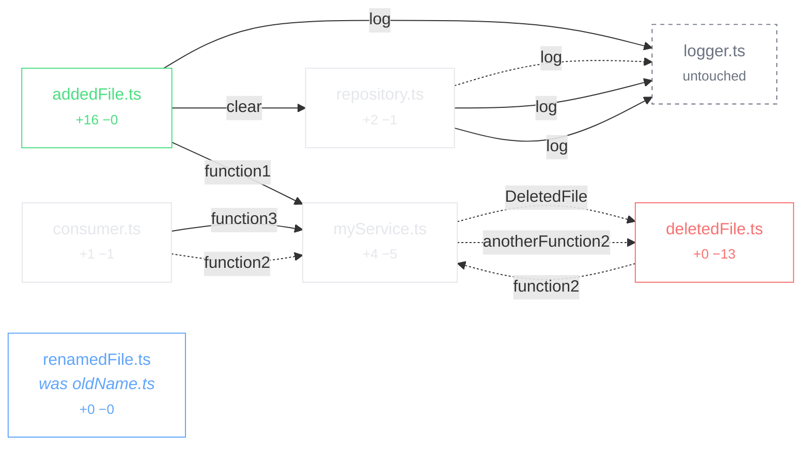

# Odin PR Review

``He saw over all worlds and every man's activity and understood everything he saw.``

A new way of reviewing PRs by using graph visualization that match human intuition.

A pull request is a graph, not a list. Odin turns the diff between a branch and
its base into a change graph: every file is a vertex, every call-site reference
in the change is a directed edge, and the colour of an edge tells you whether
the change added that relationship or took it away.


Every picture in this README is generated from the same fixture by
`scripts/generate-examples.sh`, and the sources are committed under
[`docs/examples`](docs/examples).

## Quick start

```sh
yarn install
yarn build

# Open the change graph in a browser
node packages/cli/dist/main.js graph --base main --resolve --format html -o graph.html

# Human-readable overview
node packages/cli/dist/main.js graph --base main --resolve --summary

# The graph itself
node packages/cli/dist/main.js graph --base main --resolve -o graph.json
```

Try it against the built-in fixture, which reproduces the design sketch:

```sh
fixtures/make-demo-repo-ts.sh /tmp/odin-demo
node packages/cli/dist/main.js graph -C /tmp/odin-demo -b main -H feature/graph \
  --resolve --format html -o /tmp/odin-demo.html
```

## Renderers

One layout engine feeds every output, so they are the same picture in different
materials rather than four independent drawings.

### Interactive — `--format html`

A single self-contained file. No server, no network, no build step: open it from
disk, or hand the same markup to an editor webview.

Hovering an arrow isolates it and names the reference it resolved to. Clicking
an arrow travels to its destination and flashes the card, which is the gesture
the whole tool is built around — you follow a change the way you would follow it
in an editor, but without losing your place.


Cards show the change, not the file. A run of untouched code that no arrow
reaches collapses into a single band carrying the hunk header, so a card stays
the size of its change rather than the size of its file. Line numbers run in two
columns — base on the left beside the +/− marker, head on the right — because a
single shared column interleaves the two numbering schemes and reads as nonsense
on any file that both gained and lost lines.

| Gesture | Effect |
| --- | --- |
| Hover an arrow | Isolate it, show the resolved reference and its confidence |
| Click an arrow | Travel to the definition it points at |
| Click a filename | Isolate that file and everything it touches |
| Scroll / ⌘-scroll | Pan / zoom around the cursor |
| `f` / `esc` | Fit the graph / clear the selection |

Source: [`docs/examples/graph.html`](docs/examples/graph.html).

### Static — `--format svg`

The same layout, frozen. Useful for attaching to a pull request, and as a
regression test: if the layout shifts, the file changes.


### Mermaid — `--format mermaid`

Structure only, for a pull request description or anywhere Mermaid renders.
It cannot show diff lines or anchor an arrow to one, so it answers "what talks
to what" rather than "what changed where".



Source: [`docs/examples/graph.mmd`](docs/examples/graph.mmd) (the block above
drops import edges for legibility).

### Graphviz — `--format dot`

For pipelines that already consume DOT.
Source: [`docs/examples/graph.dot`](docs/examples/graph.dot).

### Terminal — `--summary`

```
main...feature/graph
merge-base bbb36260ba95

A  src/addedFile.ts    +16 -0
M  src/consumer.ts    +1 -1
D  src/deletedFile.ts    +0 -13
~  src/logger.ts    +0 -0
M  src/myService.ts    +4 -5
R  src/renamedFile.ts  (was src/oldName.ts)    +0 -0
M  src/repository.ts    +2 -1

7 nodes, 16 edges

- src/myService.ts:12 -> src/deletedFile.ts:10 anotherFunction2 [resolved]
+ src/addedFile.ts:13 -> src/myService.ts:2 function1 [resolved]
+ src/addedFile.ts:14 -> src/repository.ts:43 clear [resolved]
+ src/consumer.ts:7 -> src/myService.ts:10 function3 [resolved]
- src/consumer.ts:7 -> src/myService.ts:10 function2 [resolved]
- src/deletedFile.ts:7 -> src/myService.ts:10 function2 [resolved]
```

Note the two `src/consumer.ts:7` lines. One call site, edited in place, resolving
to different definitions on either side of the change — and to different lines,
because `myService.ts` was edited too.

## How it works

The diff is taken from the **merge base**, not the tip of the base branch, so
the graph shows what the branch did rather than what happened on main in the
meantime.

Added and removed lines are resolved separately, against different checkouts.
A removed line does not exist in the working tree, so resolving it there would
be guesswork; instead the merge base is extracted into a temporary directory
with `git archive` and resolved against that. Reviewing a pull request never
mutates the repository being reviewed.

Edge colour comes from the line the call site sits on: a reference written on an
added line is an added reference, one written on a deleted line is a removed
reference. Targets that were never touched by the diff join the graph as
**phantom** vertices, drawn dimmed, so you can see what a change now depends on.

Where an arrow points at code the diff does not show, the source around it is
read straight out of git. Without that an arrow could only reach the edge of a
card — naming the file, but not the function.

## Layout is deterministic on purpose

The same pull request must always produce the same picture. Node ids derive from
the file path, every collection has a canonical order, JSON keys have fixed
precedence, card geometry comes from constants rather than measured text, and
the generation timestamp is opt-in. Identical inputs produce byte-identical
output — `scripts/generate-examples.sh` rerun on an unchanged tree leaves no
diff. Anything else would move nodes between runs and destroy the spatial memory
the tool exists to build.

## Packages

| Package | Role |
| --- | --- |
| `@odin/core` | Diff parsing, graph model, layout, validation, exporters. No editor dependency. |
| `@odin/resolver-ts` | Reference resolution through the TypeScript compiler API. |
| `@odin/webview` | The interactive renderer, emitted as one self-contained document. |
| `@odin/cli` | `odin graph` — build and render a change graph from the terminal. |

Reference resolution sits behind an interface, so the same graph can be produced
headlessly by the compiler API or inside the editor by a language server.

## Status

- [x] Change-graph model and reproducible JSON schema
- [x] Unified-diff parser (added, modified, deleted, renamed, binary)
- [x] Reference resolution for TypeScript and JavaScript, both sides of the diff
- [x] Phantom vertices for referenced-but-untouched files
- [x] Deterministic layered layout with line-level arrow anchors
- [x] Interactive renderer: follow an arrow, isolate a file, pan and zoom
- [x] SVG, Mermaid, Graphviz and terminal output
- [x] Collapsed gaps for untouched code, with base/head line-number columns
- [ ] VS Code extension: open the real file at the line an arrow points at
- [ ] Layout pinning so a file keeps its place across pushes
- [ ] Syntax highlighting inside cards

### Known gaps

- In a monorepo where packages import each other through built type
  declarations, cross-package edges are dropped: the definition resolves into a
  `.d.ts`, which the domain filter treats as third-party. Following declaration
  maps back to source would recover them.
- Only TypeScript and JavaScript resolve today. Other languages produce vertices
  but no edges until the editor-backed resolver lands.
- Large pull requests render every card at once. Virtualisation is needed before
  this is comfortable past a few hundred files.

## Development

```sh
yarn test                      # 75 tests: parser, graph, layout, resolver
yarn build                     # compile all packages
scripts/generate-examples.sh   # regenerate docs/examples
```

Screenshots in `docs/` are captured from the generated `graph.html` in a browser
at 1600×1000.
