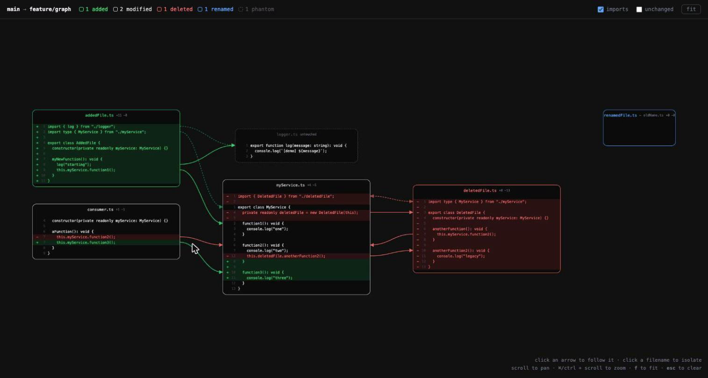
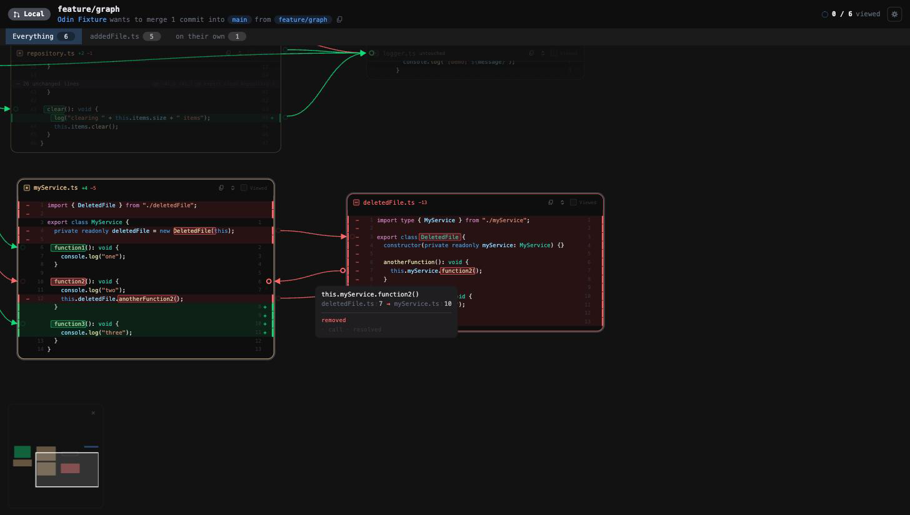
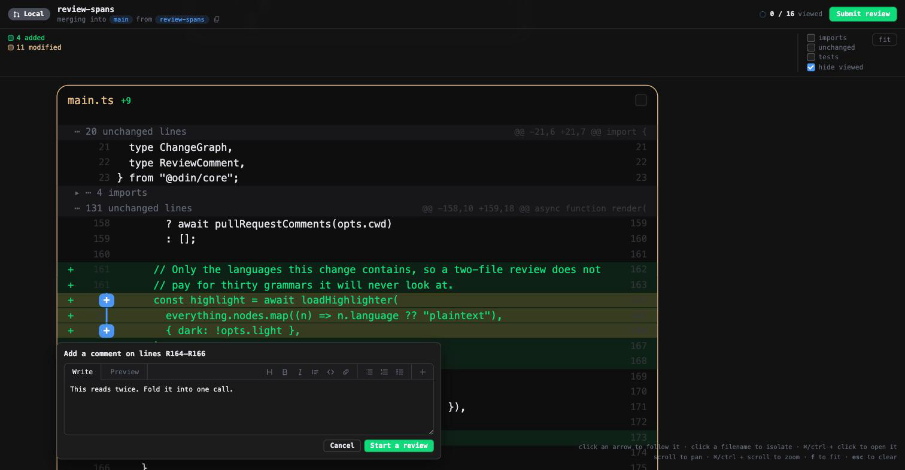
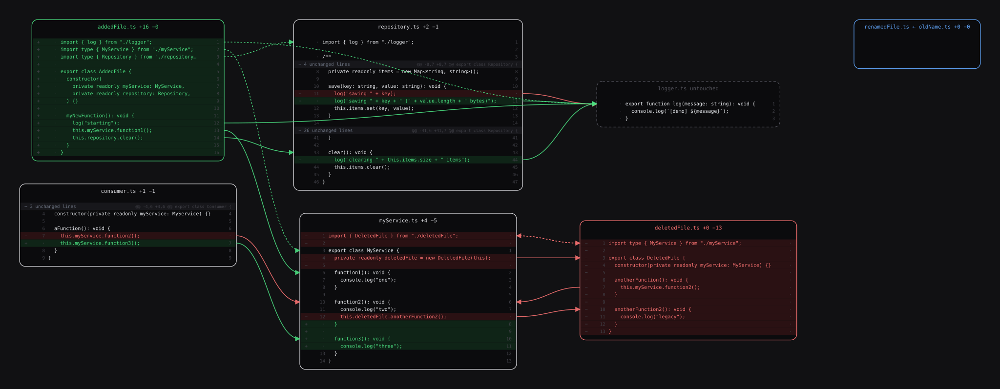
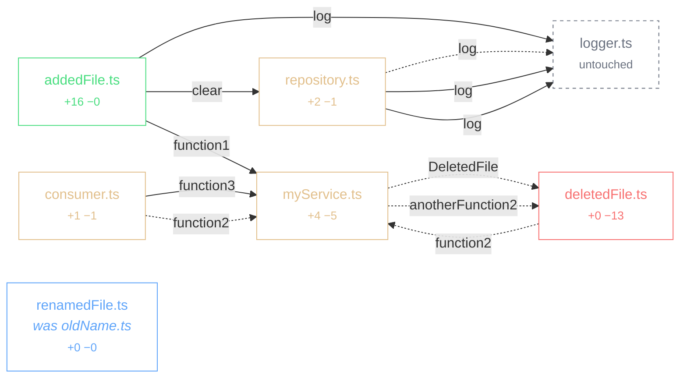
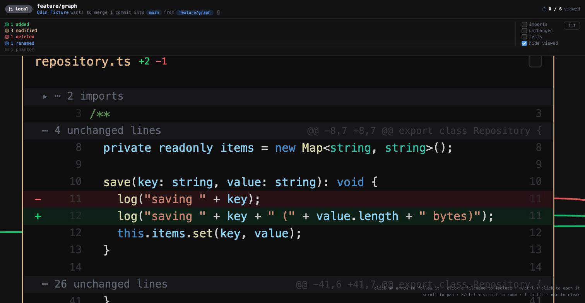

# Odin PR Review

``He saw over all worlds and every man's activity and understood everything he saw.``

A new way of reviewing PRs by using graph visualization that match human intuition.

A pull request is a graph, not a list. Odin turns the diff between a branch and
its base into a change graph: every file is a vertex, every call-site reference
in the change is a directed edge, and the colour of an edge tells you whether
the change added that relationship or took it away.



Every picture in this README is generated from the same fixture by
`scripts/generate-examples.sh`, and the sources are committed under
[`docs/examples`](docs/examples).

## Quick start

```sh
yarn install
yarn build
ln -sf "$PWD/packages/cli/dist/main.js" ~/.local/bin/odin   # or call it by path

# Render the change under review and print the url to open
odin view

# Human-readable overview
odin graph --summary

# The graph itself
odin graph --resolve -o graph.json
```

`view` is the one command worth remembering. It renders what the editor shows —
references resolved, the pull request's own comments marked against their lines
— writes it beside the repository and prints a `file://` url. The file name
comes from the repository and the branch pair, so reopening the same review
reopens the same address; `--serve [port]` hands back an `http://127.0.0.1` one
instead, for the callers a file url cannot reach.

The page it writes cannot post anything back — there is nothing behind a file to
post through. Writing is the command line's own job:

```sh
odin comments                                  # what has already been said
odin review --event comment --body "notes" \
  --comment "src/Dao.kt:180-185:this reads twice" --dry-run
odin approve
```

Everything that touches the forge goes through `gh`, so it acts as whoever is
authenticated and this program stores no credentials of its own. `--dry-run`
prints the exact payload and sends nothing, which is where a malformed comment
gets caught — the forge rejects a whole review for one bad range, taking every
other remark in it down as well.

Try it against the built-in fixture, which reproduces the design sketch:

```sh
fixtures/make-demo-repo-ts.sh /tmp/odin-demo
node packages/cli/dist/main.js graph -C /tmp/odin-demo -b main -H feature/graph \
  --resolve --format html -o /tmp/odin-demo.html
```

## Renderers

One layout engine feeds every output, so they are the same picture in different
materials rather than four independent drawings.

### Interactive — `--format html`

A single self-contained file. No server, no network, no build step: open it from
disk, or hand the same markup to an editor webview.

Hovering an arrow isolates it and names the reference it resolved to. Clicking
an arrow travels to its destination and flashes the card, which is the gesture
the whole tool is built around — you follow a change the way you would follow it
in an editor, but without losing your place.



Cards show the change, not the file. A run of untouched code that no arrow
reaches collapses into a single band carrying the hunk header, so a card stays
the size of its change rather than the size of its file. Line numbers run in two
columns — base on the left beside the +/− marker, head on the right — because a
single shared column interleaves the two numbering schemes and reads as nonsense
on any file that both gained and lost lines.

| Gesture | Effect |
| --- | --- |
| Hover an arrow | Isolate it, show the resolved reference and its confidence |
| Click an arrow | Travel to the definition it points at |
| Click a filename | Isolate that file and everything it touches |
| Scroll / ⌘-scroll | Pan / zoom around the cursor |
| Click a gap | Open the untouched code it stands for |
| Click *show N more lines* | Reveal the rest of a truncated card |
| `f` / `esc` | Fit the graph / clear the selection |

Import statements are folded into a band and their arrows hidden, both governed
by the **imports** checkbox. An import the change added or removed is never
folded away — it is a change, and folding it would hide the thing the card
exists to show — so it stays on screen with the untouched imports folding either
side of it. Nothing a diff touched is ever collapsed. A Kotlin file can open with thirty imports, which
pushes the actual change off the bottom of the card. They are still resolved, so
switching them on needs no rebuild — `--imports` does the same on the command
line.

Files the change touched always stay on the canvas. **hide read-through** takes
away the untouched files once everything pointing at them has been read, since
those are in the picture only because something referenced them; a file the
change touched goes quiet when you tick it — dimmed, struck through in the
sidebar — but it does not leave. A picture of a change with its read files
removed is a picture of something else.

Clicking a file in the sidebar brings its card to the middle of the canvas.
Opening the file itself is the card's own **Jump to file** button, beside the
reviewed box: choosing a file to look at and opening an editor on it are
different intentions, and doing both on one click means one of them was never
asked for. The button is absent where the page has no editor to ask — a graph
opened from disk cannot open anything.

Test files are hidden by default, and the **tests** checkbox brings them back.
A test tends to reference a great deal of what it exercises: on a 24-file
change here, one test file accounted for 23 of the 35 edges and buried
everything else. They are hidden rather than dropped, because sometimes the
tests *are* the change. `--tests` does the same on the command line.

Cards stop at 42 rows and offer the rest behind a bar, so one 500-line addition
cannot set the height of the whole drawing. An arrow never points at a row a
card is not showing — it falls back to the card edge, which says which file
without claiming a position it cannot point to.

An import names a file rather than a position in it, so those arrows meet the
card at its title instead of landing on whatever line one happens to hold.

Source: [`docs/examples/graph.html`](docs/examples/graph.html).

### VS Code extension

Install the packaged build and review without leaving the editor:

```sh
code --install-extension dist/odin-pr-review-0.1.0.vsix
```


Before a graph exists, the sidebar lists the repository's open pull requests —
number, title, draft or open, review state, author and age — with a filter box
above them. Clicking one checks out its branch and builds the graph; the branch
you are on is marked down its left edge. Checking out refuses outright while
the working tree is dirty, since carrying uncommitted changes onto another
branch is not a decision to make on someone's behalf.

Comments already on the pull request are marked against the lines they belong
to. Clicking a line writes a new one, optionally as a suggestion; they collect
into a pending review rather than being posted one at a time, and go out
together as **Approve**, **Comment** or **Request changes** — behind a
confirmation that names the verdict, since a review is visible to everyone and
cannot be taken back from here.



The composer is pinned under the last line it is about, at that file's own left
edge, the way an inline comment box sits in a diff — a remark belongs to a
passage, and a box that floats where the cursor happened to be makes the reader
hold the connection in their head. It carries the forge's own furniture: Write
and Preview, the markdown buttons, and a primary that says *Start a review*
until there is one and *Add review comment* after. Preview renders a deliberately
small subset of markdown and escapes everything first — the text comes from a
person and this page draws it, so nothing typed can become markup by accident.

The last button has no equivalent on the forge because it is ours: it opens a
suggestion block already filled with the lines being commented on. A suggestion
has to be the complete replacement for the lines it covers, and retyping them
from memory is how the wrong indentation gets in.

Most remarks are about a passage rather than a line, so a comment can cover
one: drag down the card, or click a line and shift-click another, and the
composer says which lines it is about in the forge's own notation — `R164–R166`
for the head side, `L` for the base. The pick is drawn the way a diff viewer
draws one — the lines washed, an edge down where the code starts, and a handle
at each end — and it survives cancelling the composer, since changing the
wording is not changing your mind about the lines. Escape or a click away
drops it. A comment already made is drawn as a single bracket down the margin
instead of a mark per line, and a suggestion written against a span replaces
the whole block. Comments already on the pull request keep their
own spans, including the ones the branch has since moved out from under.

Above the graph is the header the pull request has on the forge: its state, its
title and number, who is merging what into where, how much of it you have read,
and the button that sends the review. A reviewer arriving here has just come
from that page or is about to go back to it, and answering "what am I looking
at" in a second shape would mean learning a second shape for nothing. It renders
without a pull request too — a branch compared against another branch still has
an author, a commit count and two ref names. The forge half is asked of the `gh`
command line, so it inherits whatever authentication you already have, and its
absence changes nothing else. `--pr` does the same on the command line.

Odin gets its own activity bar entry. The sidebar lists every changed file with
its status, and expands to show the references leaving it — the graph as a list,
for when a change is too large to take in visually or you just want to scan.
Clicking a file opens its diff; clicking a reference follows it.

Then run **Odin: Review Pull Request as a Graph** from the command palette, or
trigger it from anywhere with a link:

```sh
code --open-url "vscode://odin.odin-pr-review/review?base=main"
```

The extension requires a trusted workspace. It runs git and type-checks your
files to resolve references, which is exactly what workspace trust exists to
gate, so it declares that plainly and stays disabled in Restricted Mode rather
than half-working.

Clicking an arrow opens its destination beside the graph without taking focus,
so you can trace a change without losing your place. A removed reference points
at code that is no longer in your working tree, so it opens as a read-only view
of the merge-base revision, served from git rather than written to disk.
⌘/Ctrl-click a filename to open it as a diff against the base.

| Setting | Default | Meaning |
| --- | --- | --- |
| `odin.baseRef` | `main` | Branch to compare against |
| `odin.includeImports` | `true` | Draw arrows for import statements |
| `odin.includeContext` | `false` | Also resolve references on unchanged lines |

The extension reuses the same compiler-API resolver the command line uses, so
the picture in the editor is the picture `odin graph` produces — which matters,
because the layout is meant to be something you remember.

### Static — `--format svg`

The same layout, frozen. Useful for attaching to a pull request, and as a
regression test: if the layout shifts, the file changes.



### Mermaid — `--format mermaid`

Structure only, for a pull request description or anywhere Mermaid renders.
It cannot show diff lines or anchor an arrow to one, so it answers "what talks
to what" rather than "what changed where".



Source: [`docs/examples/graph.mmd`](docs/examples/graph.mmd) (the block above
drops import edges for legibility).

### Graphviz — `--format dot`

For pipelines that already consume DOT.
Source: [`docs/examples/graph.dot`](docs/examples/graph.dot).

### Terminal — `--summary`

```
main...feature/graph
merge-base bbb36260ba95

A  src/addedFile.ts    +16 -0
M  src/consumer.ts    +1 -1
D  src/deletedFile.ts    +0 -13
~  src/logger.ts    +0 -0
M  src/myService.ts    +4 -5
R  src/renamedFile.ts  (was src/oldName.ts)    +0 -0
M  src/repository.ts    +2 -1

7 nodes, 16 edges

- src/myService.ts:12 -> src/deletedFile.ts:10 anotherFunction2 [resolved]
+ src/addedFile.ts:13 -> src/myService.ts:2 function1 [resolved]
+ src/addedFile.ts:14 -> src/repository.ts:43 clear [resolved]
+ src/consumer.ts:7 -> src/myService.ts:10 function3 [resolved]
- src/consumer.ts:7 -> src/myService.ts:10 function2 [resolved]
- src/deletedFile.ts:7 -> src/myService.ts:10 function2 [resolved]
```

Note the two `src/consumer.ts:7` lines. One call site, edited in place, resolving
to different definitions on either side of the change — and to different lines,
because `myService.ts` was edited too.

## How it works

The diff is taken from the **merge base**, not the tip of the base branch, so
the graph shows what the branch did rather than what happened on main in the
meantime.

Added and removed lines are resolved separately, against different checkouts.
A removed line does not exist in the working tree, so resolving it there would
be guesswork; instead the merge base is extracted into a temporary directory
with `git archive` and resolved against that. Reviewing a pull request never
mutates the repository being reviewed.

Edge colour comes from the line the call site sits on: a reference written on an
added line is an added reference, one written on a deleted line is a removed
reference. Targets that were never touched by the diff join the graph as
**phantom** vertices, drawn dimmed, so you can see what a change now depends on.

Where an arrow points at code the diff does not show, the source around it is
read straight out of git. Without that an arrow could only reach the edge of a
card — naming the file, but not the function.

## Layout is deterministic on purpose

The same pull request must always produce the same picture. Node ids derive from
the file path, every collection has a canonical order, JSON keys have fixed
precedence, card geometry comes from constants rather than measured text, and
the generation timestamp is opt-in. Identical inputs produce byte-identical
output — `scripts/generate-examples.sh` rerun on an unchanged tree leaves no
diff. Anything else would move nodes between runs and destroy the spatial memory
the tool exists to build.

## Packages

| Package | Role |
| --- | --- |
| `@odin/core` | Diff parsing, graph model, layout, validation, exporters. No editor dependency. |
| `@odin/resolver-ts` | Reference resolution through the TypeScript compiler API. |
| `@odin/resolver-kotlin` | Kotlin reference resolution by symbol index. |
| `@odin/webview` | The interactive renderer, emitted as one self-contained document. |
| `@odin/highlight` | Syntax colouring, from VS Code's own grammars by way of Shiki. |
| `@odin/cli` | `odin` — render a change graph, and review through it, from the terminal. |
| `odin-pr-review` | The VS Code extension. Bundled to CommonJS, since the editor loads extensions that way. |

Reference resolution sits behind an interface, so the same graph can be produced
headlessly by the compiler API or inside the editor by a language server.

## For coding agents

`.claude/` carries skills and commands so an agent can install and drive the
tool without being told how each time.

| Skill | For |
| --- | --- |
| `odin-setup` | Building it, putting `odin` on PATH, installing the extension, and the three failures that actually happen. |
| `odin-graph` | Rendering a review and getting a url; which format answers which question. |
| `odin-review` | Reading the comments already on a pull request, and writing new ones. |

Two slash commands sit on top: `/odin` renders the current branch and hands back
a url, `/odin-review` reads a pull request and drafts feedback.

The review skill is deliberately restrictive. A review is visible to the whole
team and cannot be withdrawn from here, so it tells the agent to dry-run first,
to wait for the user to say yes, and never to approve unless approval is what
was asked for. Reading needs no such ceremony — `odin comments` and
`odin graph --summary` cost nothing and answer most questions.

## Status

- [x] Change-graph model and reproducible JSON schema
- [x] Unified-diff parser (added, modified, deleted, renamed, binary)
- [x] Reference resolution for TypeScript and JavaScript, both sides of the diff
- [x] Phantom vertices for referenced-but-untouched files
- [x] Deterministic layered layout with line-level arrow anchors
- [x] Interactive renderer: follow an arrow, isolate a file, pan and zoom
- [x] SVG, Mermaid, Graphviz and terminal output
- [x] Collapsed gaps for untouched code, with base/head line-number columns
- [x] VS Code extension: open the real file at the line an arrow points at
- [ ] Layout pinning so a file keeps its place across pushes
- [ ] Syntax highlighting inside cards

## Language support

| Language | Resolver | Confidence | Both sides |
| --- | --- | --- | --- |
| TypeScript, JavaScript | TypeScript compiler API | `resolved` | yes |
| Kotlin | symbol index | `heuristic` | yes |
| anything else | — | — | — |

A file in an unsupported language still becomes a card with its diff — it just
has no arrows. That is reported rather than left to inference: the card is
outlined with a dashed border and labelled `no <language> resolver`, the
toolbar names the gap, and `meta.coverage` records it in the JSON. A card with
no arrows would otherwise be indistinguishable from a file that genuinely
references nothing, and a reviewer who cannot tell those apart will read a
blind spot as a clean bill of health.



Colouring is a separate question from resolution, and a wider one. The code in
a card is highlighted by VS Code's own TextMate grammars, through
[Shiki](https://shiki.style), so a Kotlin file reads the same here as in the
editor beside it; nothing is written by hand and nothing runs in the browser,
since the colouring happens where the page is built. Inside the editor it uses
**your** theme, not an approximation of it: the extension finds whichever one
`workbench.colorTheme` names, reads it the way the editor does — following the
`include` chain, since a theme is usually a thin file over a thick one — and
hands it to Shiki. A theme it cannot find or parse falls back to VS Code's
default rather than to no colour. On the command line there is no editor to ask,
so the default is what you get. Thirty grammars ship with
the tool — the ones teams actually review — rather than the two hundred Shiki
carries, and a language outside that list is said out loud in the toolbar
(`no highlighting for dart`) instead of appearing as a card that is quietly
grey. Adding one is a line in `packages/highlight`.

Kotlin edges are marked `heuristic` because they come from matching call sites
against an index of the repository's declarations rather than from a compiler.
Ambiguity is declined rather than guessed: where two declarations share a name
and neither the imports nor the package can separate them, no arrow is drawn.
A missing arrow is recoverable; one that sends you to the wrong file is not.

### Known gaps

- In a monorepo where packages import each other through built type
  declarations, cross-package edges are dropped: the definition resolves into a
  `.d.ts`, which the domain filter treats as third-party. Following declaration
  maps back to source would recover them.
- A file with hundreds of added lines becomes a very tall card, since there is
  nothing unchanged in it to collapse.
- Large pull requests render every card at once. Virtualisation is needed before
  this is comfortable past a few hundred files.

## Development

```sh
yarn test                      # 129 unit tests
yarn test:integration          # 6 tests inside a real VS Code extension host
yarn build                     # compile all packages
scripts/generate-examples.sh   # regenerate docs/examples
```

Screenshots in `docs/` are captured from the generated `graph.html` in a browser
at 1600×1000.
